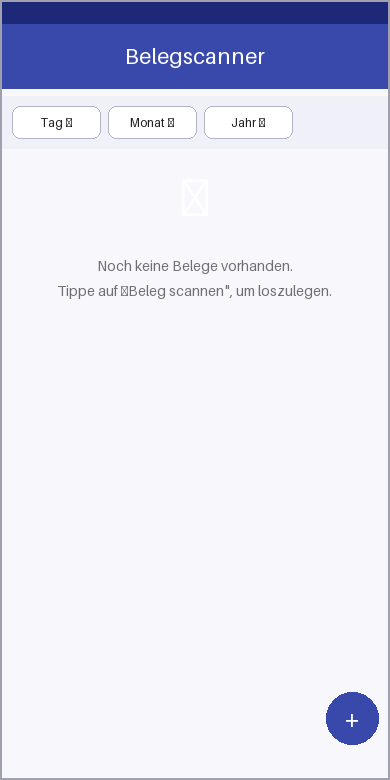
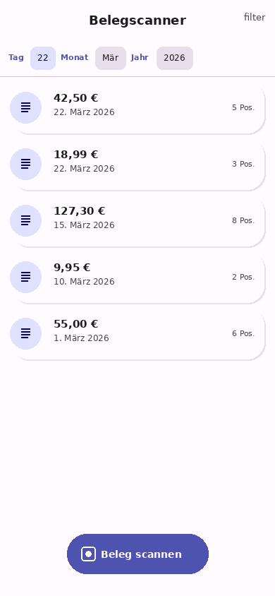
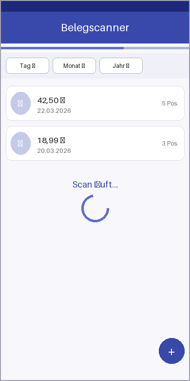
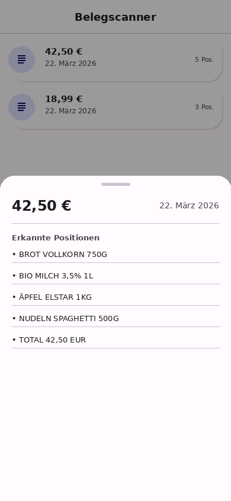

# Belegscanner v1

Eine Flutter-App für Android und iOS zum **Einscannen**, **Speichern** und **Filtern** von Belegen mittels OCR.

---

## Screenshots

| Leere Startseite | Beleg-Liste | Scan läuft | Beleg-Detail |
|:---:|:---:|:---:|:---:|
|  |  |  |  |
| Startbildschirm ohne Belege | Gefilterte Beleg-Liste | LinearProgress- und CircularProgressIndicator während des Scans | Detail-BottomSheet mit erkannten Positionen und Einzelpreisen |

---

## Features

- 📷 **OCR-Scan** – Belege per Kamera fotografieren; Text wird automatisch mit Google ML Kit erkannt
- 💶 **Betrag-Erkennung** – Regex-basiertes Parsing nach `Total`, `Summe`, `Gesamt` und `€`
- 🗂️ **Filter** – Belege nach Tag, Monat und Jahr filtern
- 📋 **Detail-Ansicht** – Alle erkannten Zeilen als Artikel-Liste im BottomSheet, inklusive automatisch erkannter Einzelpreise
- 📤 **CSV-Export** – Alle Belege als CSV-Datei exportieren und direkt per E-Mail, Messenger oder in die Cloud teilen
- 🗑️ **Löschen** – Belege per Wisch-Geste dauerhaft löschen (inkl. Bilddatei)
- 🌙 **Material 3** – Light- und Dark-Theme, dynamische Farben (Indigo-Seed)
- 🌍 **Deutsches Locale** – Euro-Formatierung (`42,50 €`) und deutsche Monatsnamen

---

## Architektur

```
lib/
├── main.dart                      # App-Einstiegspunkt, Material-3-Theme
├── models/
│   └── receipt.dart               # Receipt-Datenmodell (id, date, totalAmount, items, imagePath)
├── services/
│   ├── ocr_service.dart           # OCR-Logik: Kamera → ML Kit → Parsing (Background-Isolate)
│   └── database_service.dart      # SQLite-Persistenz: CRUD-Operationen für Belege
└── pages/
    └── home_page.dart             # StatefulWidget: Filter-Bar, ListView, Scan-Overlay, FAB, CSV-Export
```

### Datenfluss

```
App-Start
    └─► _loadReceipts()
            └─► DatabaseService.getAllReceipts()  ──► SQLite (sqflite)
                    └─► Receipt-Liste → setState → ListView

FAB drücken
    └─► _startScan()  [async]
            └─► OcrService.scanReceipt()
                    ├─► ImagePicker (Kamera)
                    ├─► GoogleMlKit TextRecognizer  (Haupt-Isolate)
                    ├─► compute(_parseOcrText)      (Background-Isolate)
                    │       ├─► _parseAmount()  (Regex, Schlüsselwörter + Fallback)
                    │       └─► _parseItems()   (Zeilenweise)
                    └─► Receipt-Objekt
                            └─► DatabaseService.insertReceipt()  ──► SQLite
                                    └─► setState → ListView

Wisch-zum-Löschen
    └─► _deleteReceipt()
            ├─► DatabaseService.deleteReceipt(id)  ──► SQLite
            └─► File(imagePath).delete()
```

---

## Verwendete Pakete

| Paket | Version | Zweck |
|---|---|---|
| `google_mlkit_text_recognition` | ^0.13.1 | OCR-Texterkennung |
| `image_picker` | ^1.1.2 | Foto aus Kamera oder Galerie |
| `intl` | ^0.19.0 | Datum- und Währungsformatierung |
| `uuid` | ^4.4.2 | Eindeutige Beleg-IDs |
| `sqflite` | ^2.3.3+1 | Lokale SQLite-Datenbank |
| `path` | ^1.9.0 | Pfad-Utilities |
| `share_plus` | ^10.0.0 | CSV-Export per Share-Sheet |

---

## Setup & Installation

### Voraussetzungen

- Flutter SDK ≥ 3.0.0
- Android Studio / Xcode
- Ein physisches Gerät oder Emulator mit Kamera-Unterstützung

### Schritte

```bash
# 1. Repository klonen
git clone https://github.com/nicolasasauer/belegscanner_v1.git
cd belegscanner_v1

# 2. Abhängigkeiten installieren
flutter pub get

# 3. App starten (Gerät muss verbunden sein)
flutter run
```

### Android

- Mindest-SDK: **21** (für Google ML Kit erforderlich)
- Berechtigungen werden automatisch angefragt: `CAMERA`, `READ_MEDIA_IMAGES`

### iOS

```bash
# CocoaPods installieren (einmalig)
sudo gem install cocoapods

# iOS-Abhängigkeiten installieren
cd ios && pod install && cd ..

# App auf einem iOS-Gerät starten
flutter run
```

- Mindest-iOS-Version: **12.0**
- Berechtigungen in `Info.plist`: `NSCameraUsageDescription`, `NSPhotoLibraryUsageDescription`

---

## Projektstruktur

```
belegscanner_v1/
├── android/                   # Android-Plattform-Dateien
│   ├── app/
│   │   ├── build.gradle
│   │   └── src/main/
│   │       ├── AndroidManifest.xml
│   │       ├── kotlin/…/MainActivity.kt
│   │       └── res/
│   └── build.gradle
├── ios/                       # iOS-Plattform-Dateien
│   ├── Runner/
│   │   ├── AppDelegate.swift
│   │   └── Info.plist
│   └── Podfile
├── lib/                       # Dart-Quellcode
│   ├── main.dart
│   ├── models/receipt.dart
│   ├── services/
│   │   ├── ocr_service.dart
│   │   └── database_service.dart
│   └── pages/home_page.dart
├── test/
│   └── receipt_test.dart      # Unit-Tests für Modell und Filter-Logik
├── screenshots/               # App-Mockup-Screenshots
└── pubspec.yaml
```

---

## 🛡️ Datenschutz & Sicherheit

### On-Device-Verarbeitung

Die gesamte OCR-Verarbeitung findet **ausschließlich auf dem Gerät** statt. Belegbilder und erkannte Texte verlassen den lokalen Speicher nicht durch App-eigenen Code. Alle Daten werden in einer lokalen SQLite-Datenbank (via `sqflite`) gespeichert, auf die nur diese App zugreifen kann.

### Google ML Kit – Telemetrie-Hinweis (Befund I-01)

Die App verwendet **Google ML Kit** für die Texterkennung. Google ML Kit ist ein Google-eigenes Framework, das nach dem einmaligen Modell-Download vollständig on-device arbeitet. Es kann jedoch sein, dass das Framework selbst **anonyme Performance- und Nutzungstelemetrie** an Google-Server überträgt. Diese Telemetrie enthält:

- ✅ **Keine** Bildinhalte oder gescannten Texte
- ✅ **Keine** erkannten Beträge oder Händlernamen
- ✅ **Keine** persönlichen Daten aus den Belegen
- ℹ️ Möglicherweise: anonyme Framework-Metriken (Verarbeitungszeit, SDK-Version, Gerätekategorie)

Für höchste Datenschutzanforderungen kann alternativ `flutter_tesseract_ocr` (vollständig offline, kein Google-Framework) evaluiert werden.

### Export-Funktion

Der CSV-Export erstellt eine temporäre Datei im App-eigenen Cache-Verzeichnis und öffnet das native Share-Sheet des Betriebssystems. Die Datei verlässt das Gerät nur durch die vom Nutzer explizit gewählte Sharing-Option (E-Mail, Messenger, Cloud-Speicher etc.).

### Datenlöschung

Belege können über die Wisch-zum-Löschen-Geste dauerhaft entfernt werden. Dabei werden sowohl der Datenbankeintrag als auch die zugehörige Bilddatei gelöscht.

---

## Tests ausführen

```bash
flutter test
```

Die Tests in `test/receipt_test.dart` prüfen:
- Erstellung und `copyWith` des `Receipt`-Datenmodells
- Die Filter-Logik (nach Tag, Monat, Jahr und Kombinationen)

---

## Lizenz

MIT © 2026 Nicolas Asauer

---

### 📜 Der Vibe-Check

Diese App ist eine reine KI-Co-Produktion (Vibe Coding). OCR ist verdammt gut, aber nicht perfekt – prüfe Beträge immer kurz nach! Alles bleibt lokal auf deinem Handy (Local-First). Kein Steuerberater-Ersatz, aber dein bester Freund für die Übersicht. 🚀
